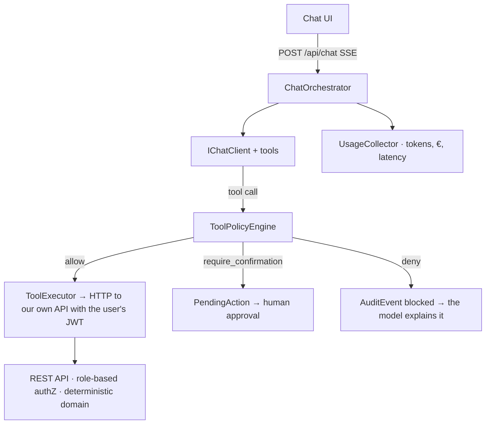

# Production-grade AI assistant in .NET: tool calling, write safety, evals & cost tracking

**invoice-assistant** is a production-grade AI assistant embedded in a demo invoicing app. It is a reference repo: it demonstrates in code the pieces that separate a demo from a production system.

> **Guiding principle: the LLM orchestrates but does not calculate.** The model decides which tool to call and writes responses; all calculations (totals, VAT, aging) and all security decisions live in deterministic server-side code.

## The 4 pieces

1. **Tool calling with propagated identity** — the assistant can never do more than the logged-in user: its tools call our own REST API over HTTP with the user's bearer token.
2. **Server-side write gate** — writes are proposed, not executed: human confirmation via `PendingAction`, structured policy in `policies.json`, prompt injection stopped by per-turn limits.
3. **Evals in CI** — prompt regressions break the pipeline. Own xUnit harness, declarative YAML cases.
4. **Cost and traces per conversation** — tokens, euros, latency and OpenTelemetry, with a daily spend kill switch.

## Anatomy of a turn



The golden rule: **the system prompt can ask for good behavior; only the server can guarantee it.** The prompt is UX, the policy is security. Key decisions are documented as ADRs in [`docs/adr/`](docs/adr/).

## Repo structure

```text
invoice-assistant/
├── AGENTS.md                     # Canonical contract for development agents
├── src/
│   ├── Api/                      # .NET 9: domain, endpoints, assistant, gate, usage
│   └── Web/                      # React 19 + Vite + TypeScript + Tailwind
├── evals/
│   ├── InvoiceAssistant.Evals/   # xUnit harness
│   └── cases/                    # Declarative *.yaml cases
├── prompts/system.md             # Versioned system prompt (hash per conversation)
├── policies.json                 # Write gate: structured rules, no DSL
├── docs/                         # Architecture + ADRs
└── .github/workflows/ci.yml      # build → tests → evals
```

## Stack

| Area | Decision |
|---|---|
| Backend | .NET 9, Minimal APIs, vertical slices |
| AI layer | `Microsoft.Extensions.AI` (`IChatClient`), no provider lock-in |
| Provider | Azure OpenAI by default; fallback to any OpenAI-compatible endpoint via config |
| Frontend | React 19 + Vite + TypeScript + Tailwind |
| Persistence | SQLite + EF Core (WAL), automatic seed |
| Auth | Demo JWT with 3 roles: Admin, Accountant, Viewer |
| Observability | OpenTelemetry (traces + metrics) |
| CI | GitHub Actions: build + tests + evals |
| License | MIT |

## Quick start

> ⚠️ Under construction: the goal is `git clone` → `.env` with an API key → `docker compose up` → working demo with seed data in under 5 minutes. See [Roadmap](#roadmap).

```bash
cp .env.example .env   # add your API key
# docker compose up    # available once F4 lands
```

## Roadmap

- **F1 · Skeleton + reads** — domain, seed, JWT auth, business endpoints, SSE chat with read tools and propagated identity, minimal UI.
- **F2 · Write gate** — ToolPolicyEngine + `policies.json`, PendingAction, approve/reject, AuditEvent, idempotency and per-turn limits.
- **F3 · Evals + CI** — xUnit harness, ~35 cases, evals job with per-run budget.
- **F4 · Cost, traces and polish** — UsageCollector, spend kill switch, Usage page, OpenTelemetry, Docker and deploy.

**Out of scope for v1:** RAG, cross-session memory, multi-agent, real multi-tenancy, real legal invoicing (Verifactu, etc.), i18n. The invoicing app is a credible pretext, not a product.

## License

[MIT](LICENSE)
