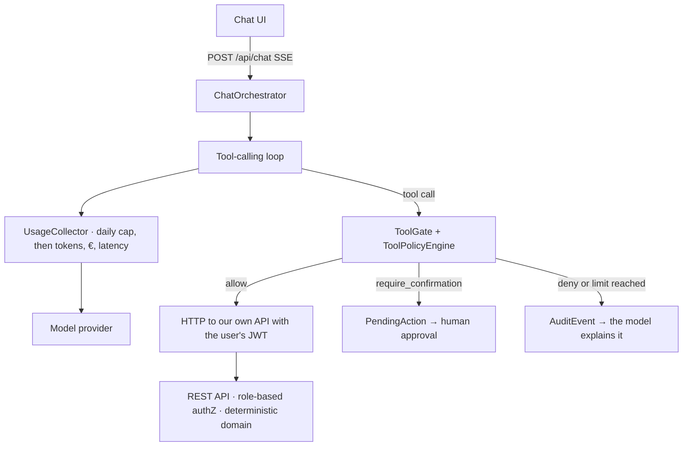

# Production-grade AI assistant in .NET: tool calling, write safety, evals & cost tracking

**invoice-assistant** is a production-grade AI assistant embedded in a demo invoicing app. It is a reference repo: it demonstrates in code the pieces that separate a demo from a production system.

> **Guiding principle: the LLM orchestrates but does not calculate.** The model decides which tool to call and writes responses; all calculations (totals, VAT, aging) and all security decisions live in deterministic server-side code.

## The 4 pieces

1. **Tool calling with propagated identity** — the assistant can never do more than the logged-in user: its tools call our own REST API over HTTP with the user's bearer token.
2. **Server-side write gate** — writes are proposed, not executed: human confirmation via `PendingAction`, structured policy in `policies.json`, prompt injection stopped by per-turn limits.
3. **Evals in CI** — prompt regressions break the pipeline. Own xUnit harness, declarative YAML cases.
4. **Cost and traces per conversation** — tokens, euros, latency and OpenTelemetry, with a daily spend kill switch.

## Anatomy of a turn



The golden rule: **the system prompt can ask for good behavior; only the server can guarantee it.** The prompt is UX, the policy is security. Key decisions are documented as ADRs in [`docs/adr/`](docs/adr/).

## What it looks like

Every screenshot below is the running app against the seeded ledger — around 40 invoices, the three
demo users, the real policy file, `gpt-4o-mini` behind `/api/chat`. Nothing is staged: the model
picked its own tools, the figures came back from the API, the approval summaries are written by the
server, and the refusals are the gate's own words.

### The ledger

Sign in as one of three seeded users. The role you pick is the role the assistant inherits.


The invoicing app itself: outstanding receivables and their aging on top, the ledger below, and the
assistant docked to the right on every page.


Selecting an invoice opens its lines, its VAT and its total — all computed in the domain, never by
the model.


Clicking an aging bucket narrows the ledger to the invoices in it, using the days-overdue figure the
server sent.


### Asking the assistant

A read question becomes a tool call. The chip names the tool while it runs, and every number in the
answer came back from the API.


### The write gate

Asking an Accountant's assistant to settle a €1,004.30 invoice does not settle it. The gate turns
the tool call into a proposal with a five-minute window, described by the server rather than the
model.


Approving is not the last word either. Policy allows an Accountant to confirm it; the API's own
€1,000 settlement ceiling still refuses it, and nothing changes.


Under the ceiling, the same flow goes through: approve, and the write executes under the approver's
identity.


A Viewer's write never becomes a proposal at all. The policy denies it, the audit log records it,
and the model is left to explain a decision it did not make.


Asked for two cancellations at once, the model duly issued two tool calls. The per-turn write limit
stopped the second before it reached the ledger, and the first is still only a proposal — waiting on
an Admin, because an Accountant cannot cancel. This is what stops a prompt injection carried inside
invoice data.


### What it costs

Every model call is metered where it happens, priced from a table in configuration and summed
against the daily kill switch.


Opening a conversation interleaves its model calls with the gate's decisions, so a refusal and the
tokens spent around it sit on one timeline.


## Repo structure

```text
invoice-assistant/
├── AGENTS.md                     # Canonical contract for development agents
├── src/
│   ├── Api/                      # .NET 10: domain, endpoints, assistant, gate, usage
│   └── Web/                      # React 19 + Vite + TypeScript + Tailwind
├── tests/Api.Tests/              # Domain unit tests + integration tests on real PostgreSQL
├── evals/
│   ├── InvoiceAssistant.Evals/   # xUnit harness
│   └── cases/                    # Declarative *.yaml cases
├── prompts/system.md             # Versioned system prompt (hash per conversation)
├── policies.json                 # Write gate: structured rules, no DSL
├── docs/                         # Architecture + ADRs + deployment + screenshots
├── Dockerfile                    # SPA build → API publish → one runtime image
├── docker-compose.yml            # The whole demo, or just PostgreSQL for development
├── docker-compose.coolify.yml    # The same stack with the panel owning domain, TLS and proxy
└── .github/workflows/ci.yml      # repo checks → backend → frontend → evals
```

## Stack

| Area | Decision |
|---|---|
| Backend | .NET 10, Minimal APIs, vertical slices |
| AI layer | `Microsoft.Extensions.AI` (`IChatClient`), no provider lock-in |
| Provider | Azure OpenAI by default; fallback to any OpenAI-compatible endpoint via config |
| Frontend | React 19 + Vite + TypeScript + Tailwind 4 |
| Persistence | PostgreSQL + EF Core, migrations and seed on startup |
| Auth | Demo JWT with 3 roles: Admin, Accountant, Viewer |
| Observability | OpenTelemetry (traces + metrics) |
| CI | GitHub Actions: build + tests + evals |
| License | MIT |

## Quick start

```bash
cp .env.example .env    # optional: add an AI provider key
docker compose up       # http://localhost:8080
```

One container serves both the API and the SPA. Pick one of the three demo users; the shared password
is `demo1234`. Migrations and around 40 seeded invoices are applied on startup, so there is no
database step.

Developing rather than demoing — two terminals, with hot reload:

```bash
docker compose up -d postgres    # just the database (ADR 006)
dotnet run --project src/Api     # http://localhost:5080
npm install --prefix src/Web && npm run dev --prefix src/Web   # http://localhost:5173
```

**Without an AI key** the ledger, filters and API all work; only `/api/chat` answers 503 telling you
which variables it wants. That is deliberate — you can read and run the repo before signing up to a
provider.

All commands, including the quality gates, live in [`.agent/commands.md`](.agent/commands.md).

## Deploying it

The same image runs anywhere a container does; it takes its whole configuration from environment
variables. On **Coolify**, point a Docker Compose resource at
[`docker-compose.coolify.yml`](docker-compose.coolify.yml), set `JWT_SIGNING_KEY` and
`POSTGRES_PASSWORD`, and give the `app` service a domain written with the container port
(`https://invoices.example.com:8080`). On a VPS you manage, `docker compose up -d` is the whole
deploy.

Behind any TLS-terminating proxy there is one setting worth knowing about — the assistant calls our
own API over HTTP, so it needs to know where "itself" is — and one worth deciding before you hand
the URL out, the daily spend cap. Both, plus a managed-database variant and a troubleshooting
table, are in [`docs/deployment.md`](docs/deployment.md).

## What a conversation costs

Every call to the model is metered where it happens — inside the tool-calling loop, not once per
turn, because a turn that uses tools makes several calls. Each one is recorded with its tokens,
latency and cost in euros, priced from a table in configuration; the **Usage** page shows the total
per conversation and a timeline that interleaves each model call with the write gate's decisions.

The same table backs the **spend kill switch**: a global daily cap (`USAGE_DAILY_BUDGET_EUR`, 1€ by
default) checked before the turn starts *and* before every model call inside it. Once it is spent,
`/api/chat` answers `429` and the rest of the app carries on working. A per-user rate limit does
nothing about a scraper with many IPs — the euro cap is what makes a public demo safe to leave
running with a real key in it. The reasoning, including what happens to a model with no configured
price, is in [ADR 008](docs/adr/008-cost-accounting-and-the-spend-kill-switch.md).

## Roadmap

- **F1 · Skeleton + reads** ✅ — domain with enforced transitions, seed, JWT auth, business
  endpoints, SSE chat with read tools and propagated identity, invoices + chat UI.
- **F2 · Write gate** ✅ — ToolPolicyEngine over `policies.json`, five gated write tools,
  PendingAction with approve/reject, AuditEvent, idempotency and per-turn limits.
- **F3 · Evals + CI** ✅ — xUnit harness against a real model, 35 fact-based cases, CI job with
  per-run token budget and markdown report; a one-line prompt regression turns the pipeline red.
- **F4 · Cost, traces and polish** ✅ — UsageCollector metering every model call, global daily spend
  kill switch, Usage page with per-conversation cost timelines, OpenTelemetry traces and metrics,
  single-container Docker build.

Roles are visible in the chat from F2 on. A Viewer's write is refused outright by policy; an
Accountant settles small invoices without being asked, is asked to confirm larger ones, and is
refused by the API above a configurable ceiling (€1,000 by default) even after a human approves —
the three bands are tabulated in [`docs/architecture.md`](docs/architecture.md).

**Out of scope for v1:** RAG, cross-session memory, multi-agent, real multi-tenancy, real legal invoicing (Verifactu, etc.), i18n. The invoicing app is a credible pretext, not a product.

## License

[MIT](LICENSE)
