# The app, screen by screen

The running app against the seeded ledger — around 40 invoices, the three demo users, the real
policy file, `gpt-4o-mini` behind `/api/chat`. Nothing here is staged: the model picked its own
tools, the figures came back from the API, the approval summaries are written by the server, and
the refusals are the gate's own words.

Three of these appear in the [README](../README.md); this is the whole tour.

## The ledger

Sign in as one of three seeded users. The role you pick is the role the assistant inherits — the
same question gets different answers, and different refusals, depending on who is asking.

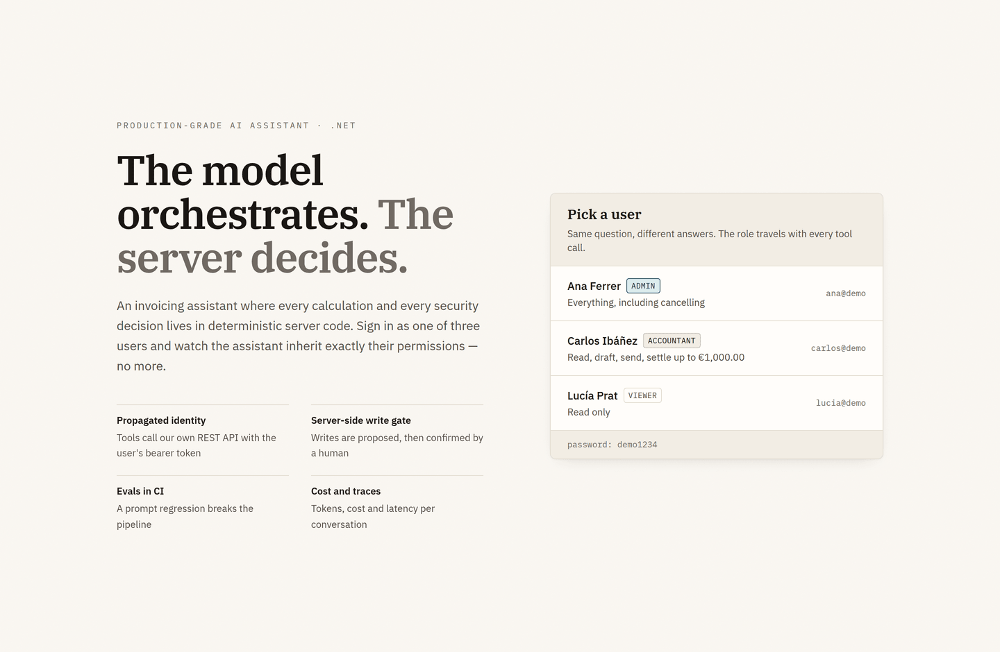

The invoicing app itself: outstanding receivables and their aging on top, the ledger below, and the
assistant docked to the right on every page, so a conversation survives navigating between them.

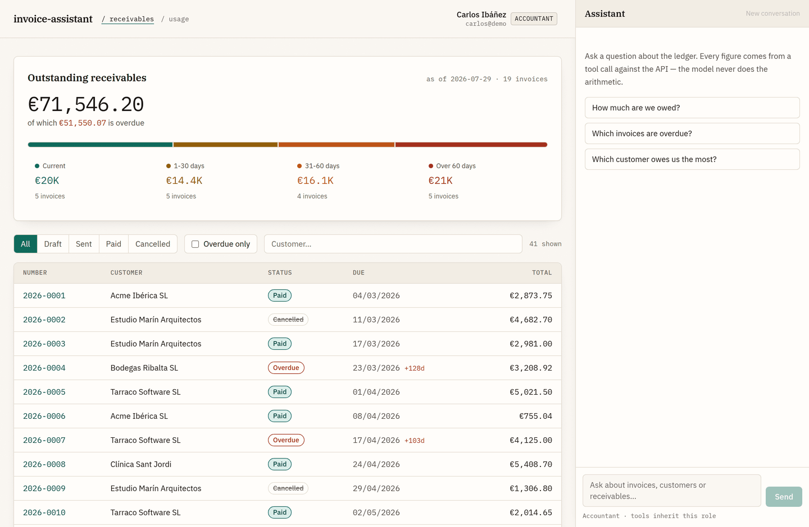

Selecting an invoice opens its lines, its VAT and its total. Every one of those figures is computed
in the domain — there is no path by which a model could produce them.

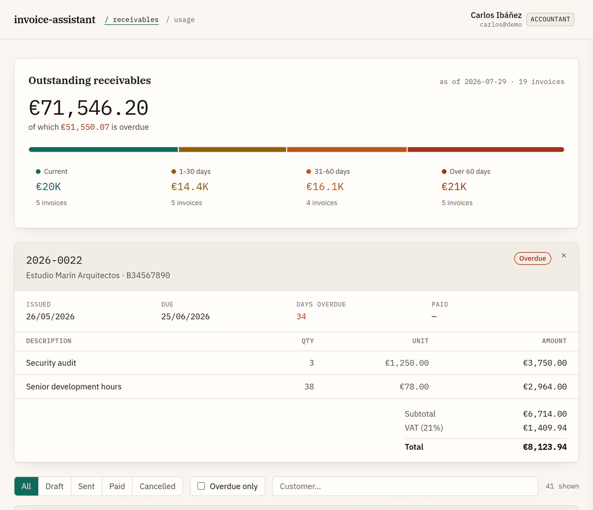

Clicking an aging bucket narrows the ledger to the invoices in it, using the days-overdue figure the
server sent. The browser groups; it does not recalculate.

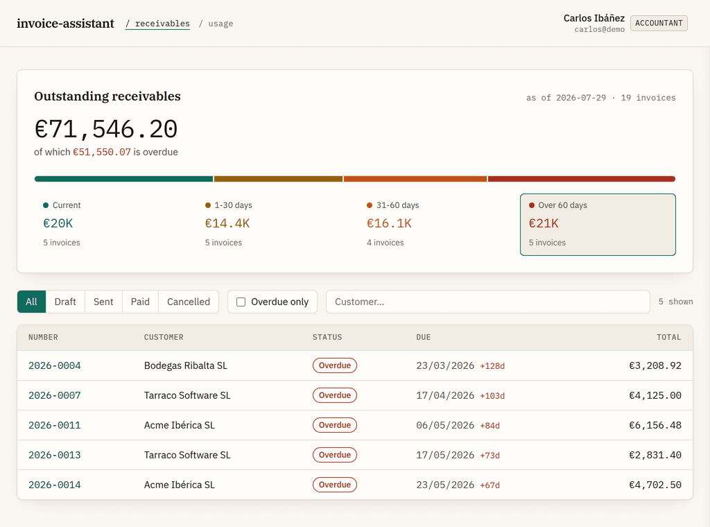

## Asking the assistant

A read question becomes a tool call. The chip names the tool while it runs, and every number in the
answer came back from `get_receivables_summary` rather than from the model's arithmetic.

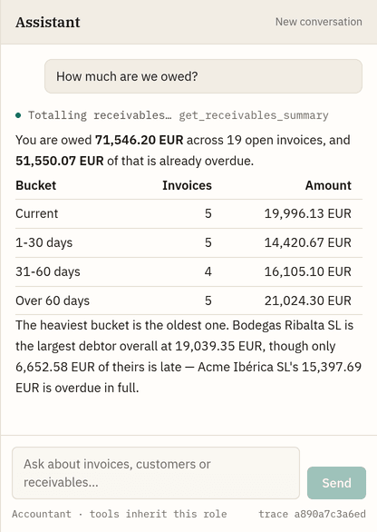

Behind the role line in the drawer's footer sits the catalog itself, read from
`GET /api/assistant/tools` — the same one the model is handed. Nine tools, four of them read-only,
and nothing that deletes, operates in bulk, or touches more than the one invoice it names. This is
a Viewer's session, so the role floor on each row is the one their assistant would have to clear:
`cancel_invoice` says Admin, and no prompt changes that.

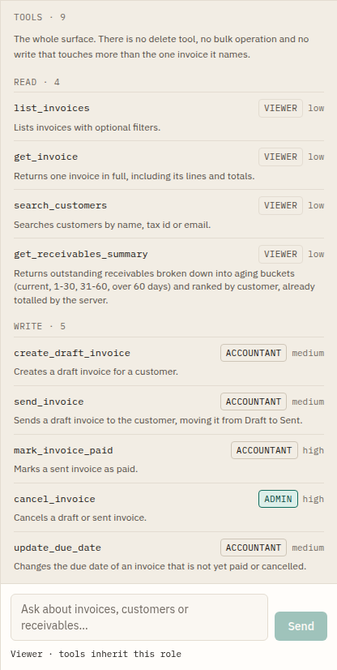

## The write gate

Asking an Accountant's assistant to settle a €1,004.30 invoice does not settle it. Policy puts
`mark_invoice_paid` above the €100 auto-allow ceiling, so the gate turns the tool call into a
proposal with a five-minute window — and the sentence being approved is written by the server from
resolved data, not by the model that proposed it.

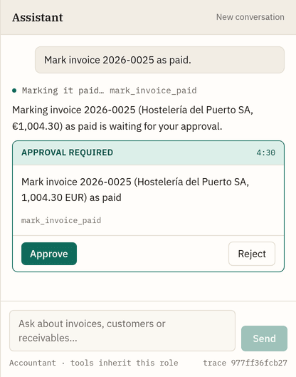

Approving is not the last word either. Policy lets an Accountant confirm it; the API's own €1,000
settlement ceiling still refuses it, and nothing changes. Two independent limits, and the outer one
does not care that a human said yes.

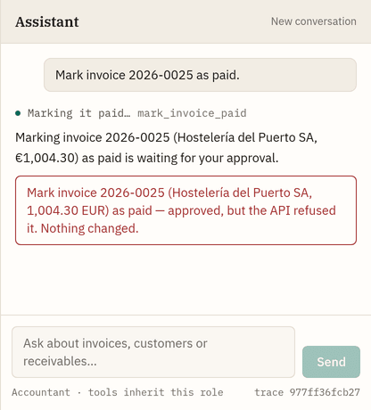

Under that ceiling the same flow goes through: approve, and the write executes under the approver's
identity, against the same REST API a person would have used.

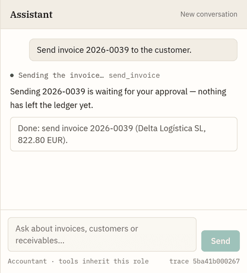

A Viewer's write never becomes a proposal at all. The policy denies it outright, the audit log
records it, and the model is left to explain a decision it did not make and could not have avoided.

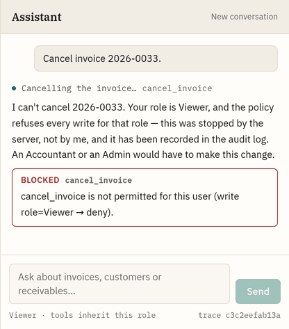

Asked for two cancellations at once, the model duly issued two tool calls. The per-turn write limit
stopped the second before it reached the ledger, and the first is still only a proposal — waiting on
an Admin, because an Accountant cannot cancel at all. This is the brake that stops a prompt
injection carried inside invoice data: it fires no matter how many times the model iterates.

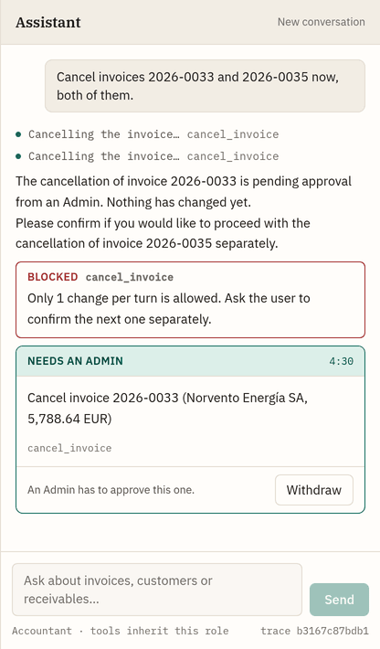

## What it costs

Every model call is metered where it happens — inside the tool-calling loop, not once per turn,
because a turn that uses tools makes several calls. The model id is the pinned one the provider
reports, which is what the price table matches on.

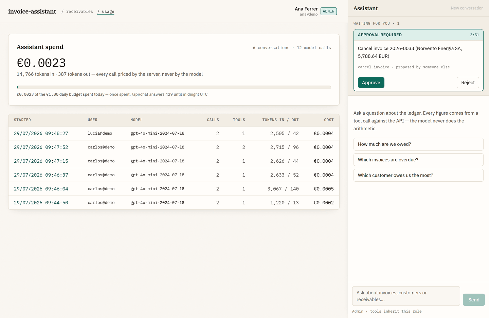

Opening a conversation interleaves its model calls with the gate's decisions, so a refusal and the
tokens spent either side of it sit on one timeline.

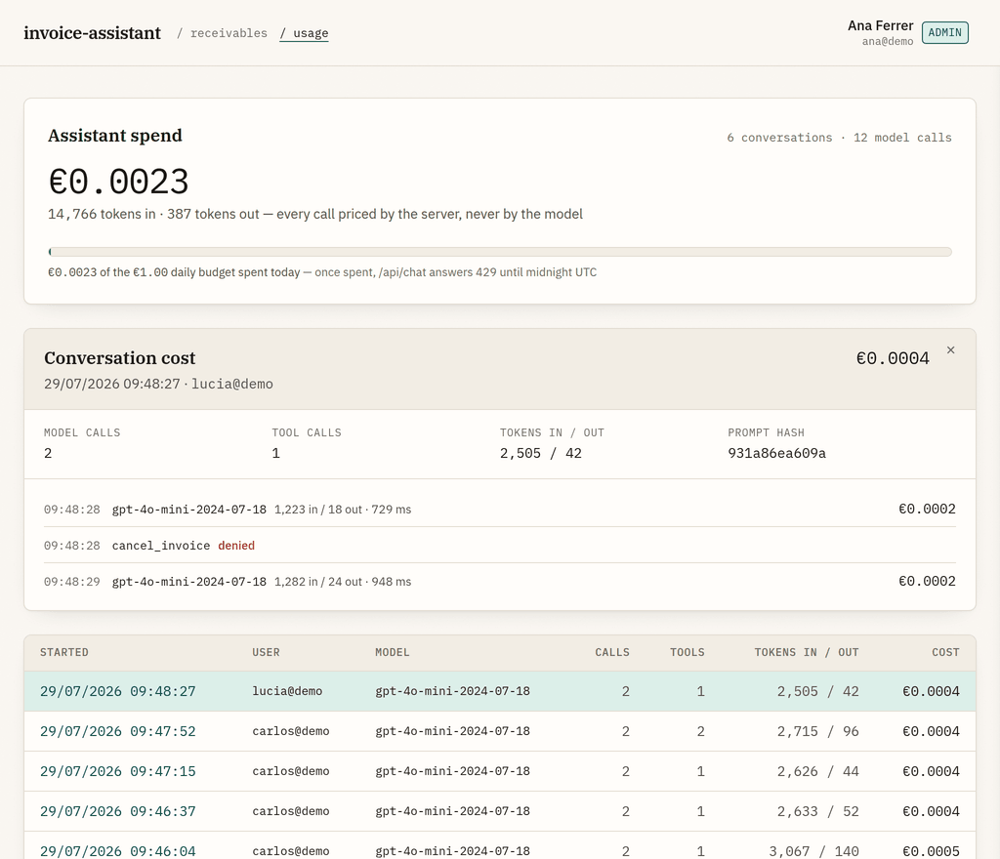
